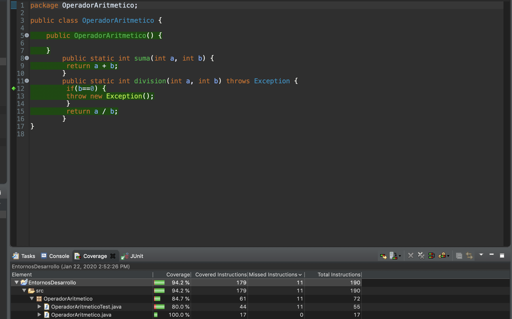
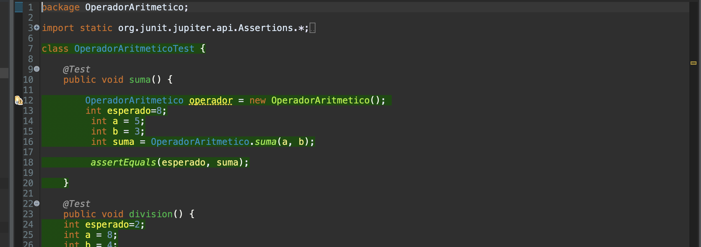

README OperadorAritmetico
=========================

###Alumno: Miguel García Insua

 * En la clase `OperadorAritmetico` añadimos el test que hay en el campus virtual.

 * Al realizar el coverage con JUnit podemos ver que las lineas de código de la clase que no se ejecutan
 	son las que corresponden a la instancia de la clase.
 	
 * Para solucionar este error lo que he pensado es  en hacer un constructor en la clase `OperadorAritmetico`
 
 	
 
 * Por último he creado un objeto de tipo `OperadorAritmetico` con un new llamando al constructor que acabamos de crear en la clase OperadorAritmetico para obligar al test a pasar por la parte que faltaba del código (y la parte nueva de codigo que hemos añadido con el constructor).
 	
 	
 	
 * Si volvemos hacer un coverage del test con JUnit podremos ver que el código de la clase `OperadorAritmetico`
 	ya se ejecuta al 100%.