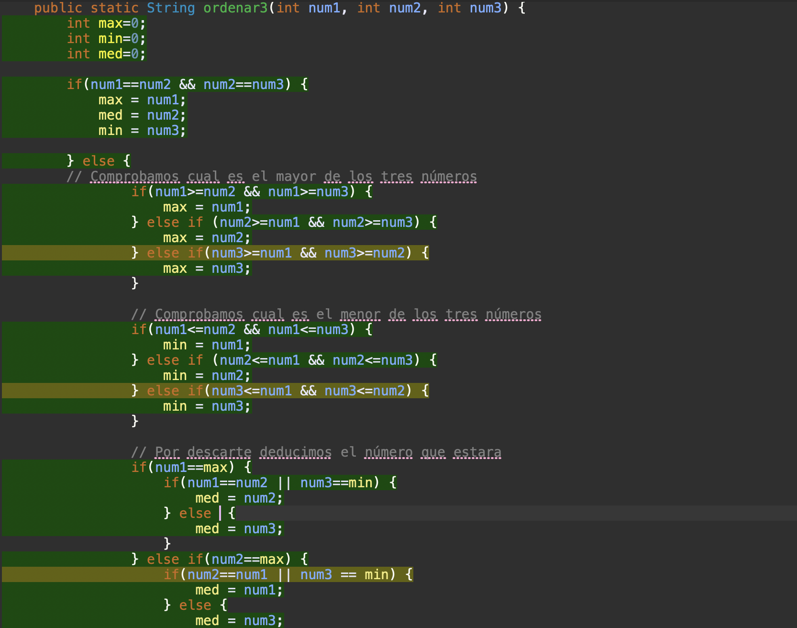
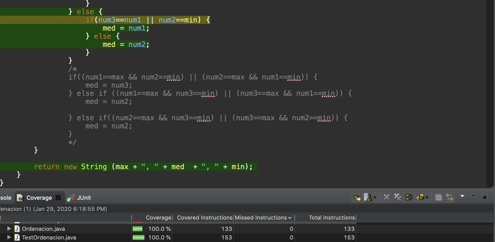

Practica Ordenación
===================

Alumno: Miguel García
---------------------

* El algoritmo `Ordenacion` y el test `TestOrdenacion` están comentados de tal manera que se puede entender perfectamente lo que es cada cosa.  

* La función `ordenar3()` que está en la clase `Ordenación.java` recibe tres números por parámetros y devuelve
una cadena con los tres numeros ordenados de mayor a menor. Por ejemplo: "3, 2, 1".  

* El código de `ordenar3()` consta de diferentes pasos:  
	     1. Comprueba si los tren números son iguales; si los 3 son iguales devuelve una cadena con los números
	     ordenados.  
	     2. Si no son iguales mira que número de los 3 es el mayor(si hay dos iguales cogerá uno de los dos).  
	     3. A continuación mira que número es el menor (en caso de que haya dos iguales cogerá uno de ellos).  
	     4. Por último pasamos a comprobar cual es el número intermedio, en función de si hay dos números iguales
	     o no y de cual es el máximo y cual es el mínimo  
	     
	     
* El Test `TestOrdenacion` consta de todas las combinaciones posibles que se pueden hacer con tres números incluyendo que se puedan repetir dos de los números y que los tres números sean iguales.  

* Al hacer el Test con JUnit y EclEmma podemos comprobar que hemos probado todo el código que hay en `Ordenacion.java` y que el programa nos ordena de manera correcta los números en cualquiera de las diferentes combinaciones que puede recibir.

  

