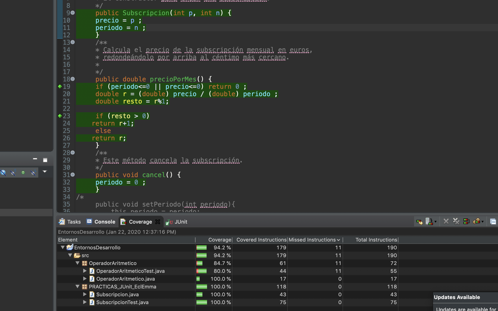
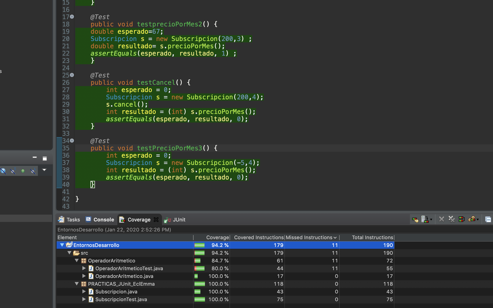

README Subscripcion
===================

###Alumno: Miguel García Insua

 * Si probamos el coverage tal y como lo dejas en el aula virtual podemos ver que las lineas
 	de código que no se ejecutan en la clase `Subscripcion` corresponden al método `cancel()`.  
 		  
 	
 * Para solucionar este error he pensado en añadir un caso de pruba para el método `cancel()`.
   Este caso de prueba utiliza el método `cancel()` y compruebe que nos devuelve un valor 0.
   
   
     
 * Si realizamos de nuevo el coverage podremos ver que ya el test ejecuta el 100% del código
 	en la clase `Subscripcion`.
 	
 	