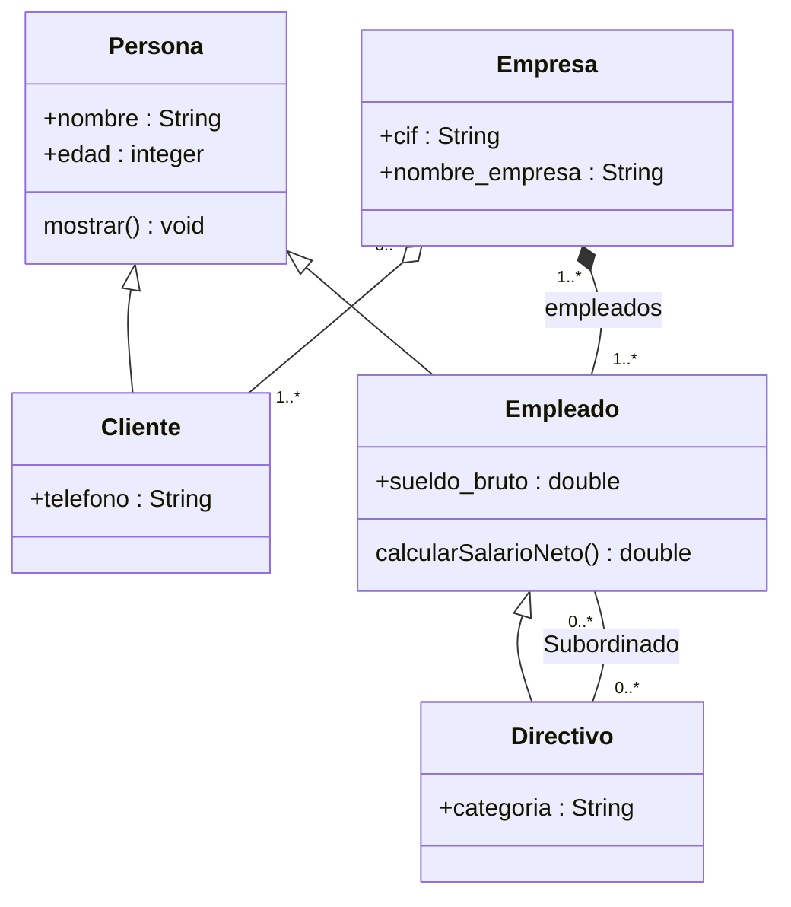

[Enlace al diagrama pintado por mermaid](imagen1.png)

``` mermaid

classDiagram

    Persona <|-- Cliente
    Persona <|-- Empleado
    Empleado <|-- Directivo
    
    Empresa "0..*" o-- "1..*" Cliente
    Empresa "1..*" *-- "1..*" Empleado : empleados
    Empleado "0..*" -- "0..*" Directivo : Subordinado
    
    class Persona {
        +nombre : String
        +edad : integer
        mostrar() void
    }

    class Empresa {
        +cif : String
        +nombre_empresa : String
    }

    class Empleado {
        +sueldo_bruto : double
        calcularSalarioNeto() double
    }

    class Cliente {
        +telefono : String
    }

    class Directivo {
        +categoria : String
    }

```