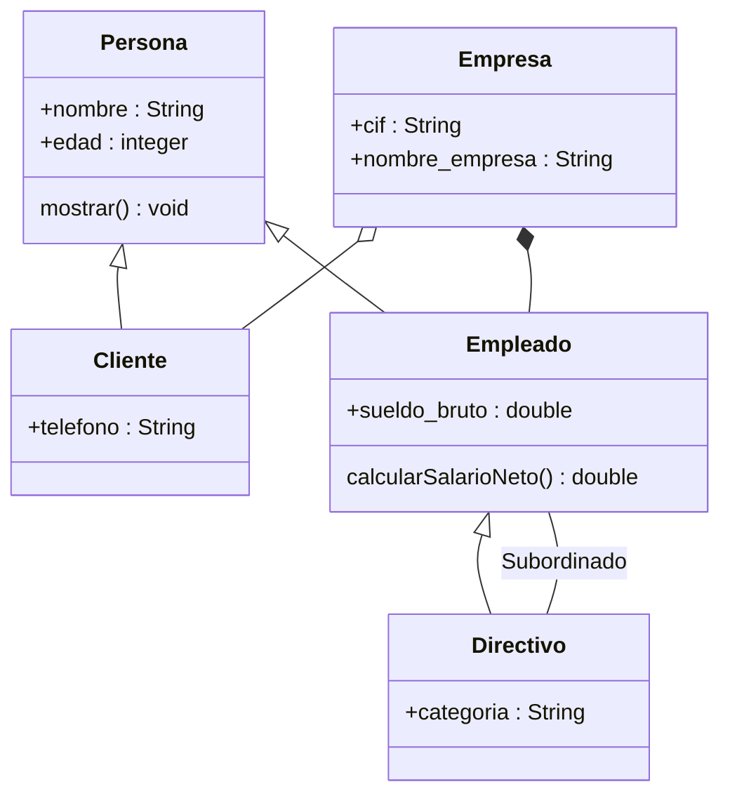

[Enlace al diagrama pintado por mermaid](imagen.png)

``` mermaid
classDiagram

    Persona <|-- Cliente
    Persona <|-- Empleado
    Empleado <|-- Directivo
    
    Empresa o-- Cliente
    Empresa *-- Empleado
    Empleado -- Directivo : Subordinado

    class Persona {
        +nombre : String
        +edad : integer
        mostrar() void
    }

    class Empresa {
        +cif : String
        +nombre_empresa : String
    }

    class Empleado {
        +sueldo_bruto : double
        calcularSalarioNeto() double
    }

    class Cliente {
        +telefono : String
    }

    class Directivo {
        +categoria : String
    }
```