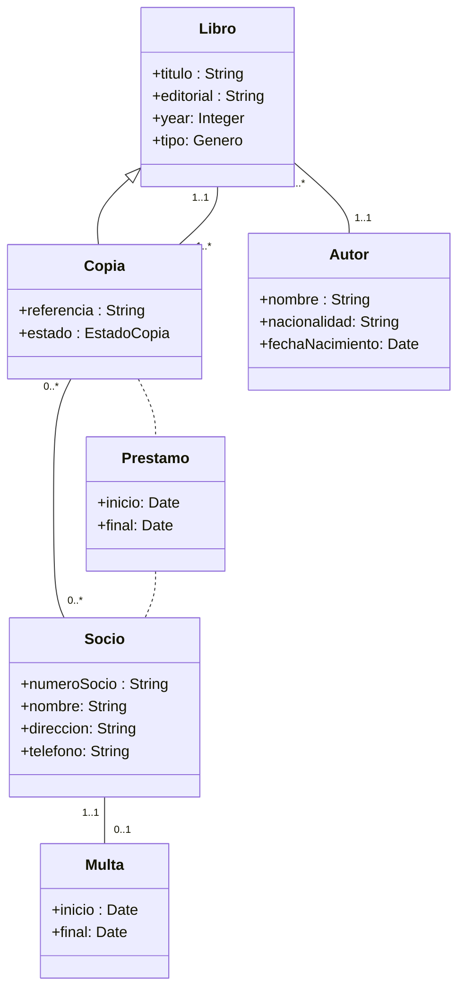

[Enlace al diagrama pintado por mermaid](imagen2.png)

``` mermaid
classDiagram

    Libro <|-- Copia
    
    
    Libro "1..*" -- "1..1" Autor
    Libro "1..1" -- "1..*" Copia
    Copia "0..*" -- "0..*" Socio

    Copia .. Prestamo
    Prestamo .. Socio
    
    Socio "1..1" -- "0..1" Multa
    
    class Libro {
        +titulo : String
        +editorial : String
        +year: Integer
        +tipo: Genero
    }

    class Copia {
        +referencia : String
        +estado : EstadoCopia
    }

    class Socio {
        +numeroSocio : String
        +nombre: String
        +direccion: String
        +telefono: String
    }

    class Multa {
        +inicio : Date
        +final: Date
    }

    class Autor {
        +nombre : String
        +nacionalidad: String
        +fechaNacimiento: Date
    }

    class Prestamo {
        +inicio: Date
        +final: Date
    }

```