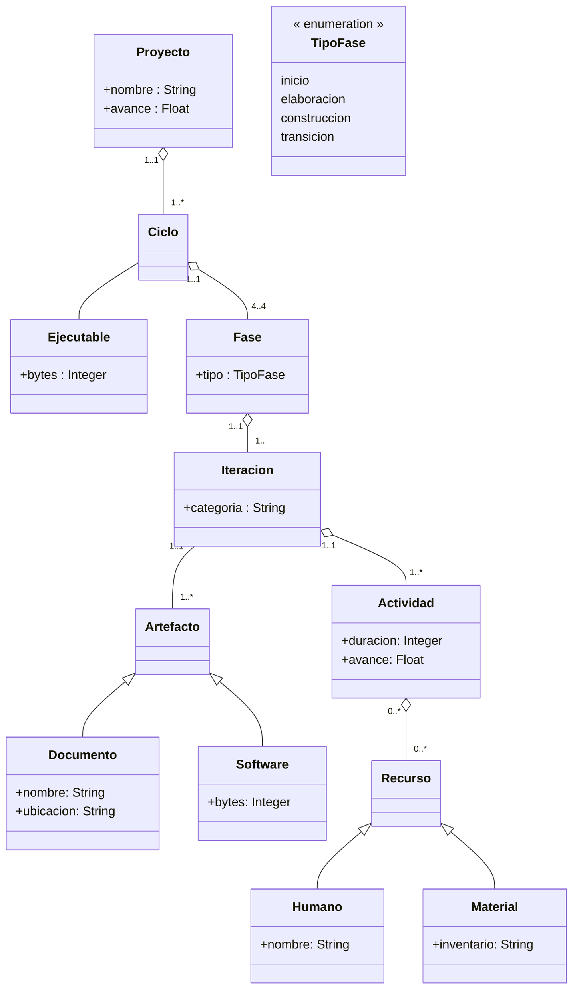

[Enlace al diagrama pintado por mermaid](imagen4.png)

``` mermaid

classDiagram

    Proyecto "1..1" o-- "1..*" Ciclo
    Ciclo -- Ejecutable
    Ciclo "1..1" o-- "4..4" Fase
    
    Fase "1..1" o-- "1.." Iteracion

    Iteracion "1..1 "o-- "1..*" Actividad
    Iteracion "1..1" -- "1..*" Artefacto

    Artefacto <|-- Documento
    Artefacto <|-- Software

    Actividad "0..*" o-- "0..*" Recurso

    Recurso <|-- Humano
    Recurso <|-- Material
    
    class Proyecto {
        +nombre : String
        +avance : Float
    }

    class Ejecutable {
        +bytes : Integer
    }

    class Ciclo {
        
    }

    class Fase {
        +tipo : TipoFase
    }

    class Iteracion {
        +categoria : String
    }

    class TipoFase {
        << enumeration >>
        inicio
        elaboracion
        construccion
        transicion
    }

    class Actividad {
        +duracion: Integer
        +avance: Float
    }

    class Recurso {

    }

    class Documento {
        +nombre: String
        +ubicacion: String
    }

    class Software {
        +bytes: Integer
    }

    class Humano {
        +nombre: String
    }

    class Material {
        +inventario: String
    }

```